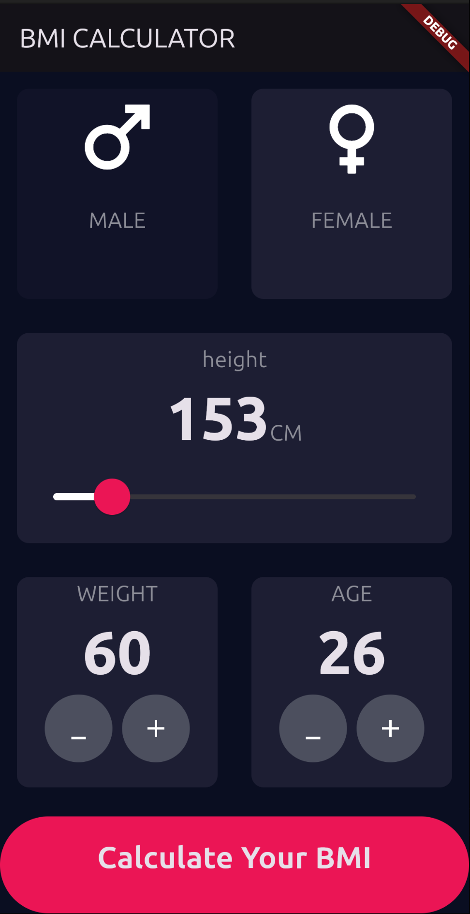
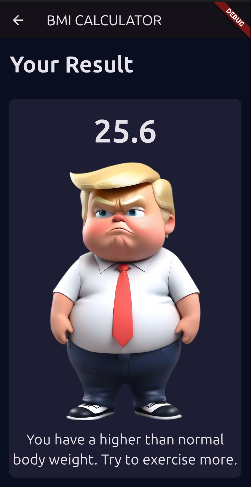

# BMI Calculator

A simple and beautiful app for calculating Body Mass Index (BMI) built with **Flutter**. This app calculates BMI and provides appropriate health interpretation by receiving the user's height, weight, age and gender.

## ✨ Features

- **Gender selection** with interactive cards and icons

- **Dynamic slider** for adjusting height

- **+ and - buttons** for adjusting weight and age

- **Instant BMI calculation** with standard formula

- **Result display with color scheme** (underweight, normal, overweight, obese)

- **Smooth navigation** between input page and results


📱 App Preview

| Input Page | Result Page |
|:---:|:---:|
|  | 

## 🛠 Technologies

- **Flutter** - Core development framework
- **Dart** - Programming language

## 📂 Project structure

new_bmi_calculator/
├── lib/
│ ├── components/
│ │ ├── reusable_card.dart
│ │ ├── icon_content.dart
│ │ └── round_icon_button.dart
│ ├── screens/
│ │ ├── input_page.dart
│ │ └── result_page.dart
│ ├── calculator_brain.dart
│ ├── constants.dart
│ └── main.dart
├── pubspec.yaml
└── README.md

## 🚀 How to run

### Prerequisites

- Flutter SDK (version 3.x or higher)
- Dart SDK (version 2.x or higher)
- A code editor like Android Studio or VS Code

### Installation steps

1. **Clone the repository**

```bash
git clone https://github.com/khaliqsarwari2-bit/bmi_calculator.git
cd bmi_calculator
